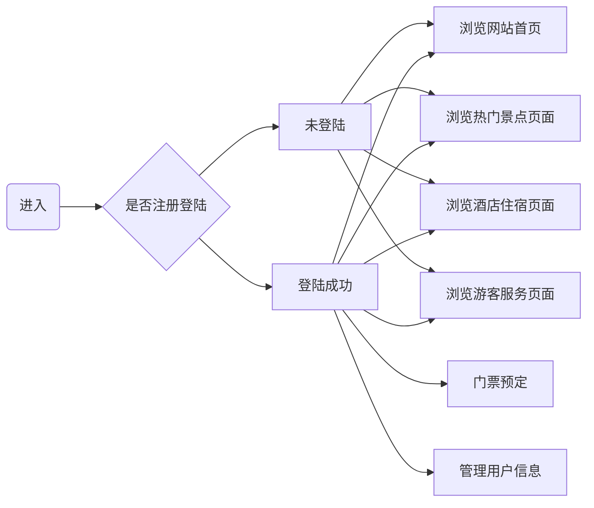

# 项目概述
1. 项目名称  
   旅游信息网（Tourism-Information-Network）  
   一个全栈项目，学习练手，为人们查询旅游信息和预订旅游产品提供便利  
2. 开发环境
 - 操作系统：Ubuntu
 - 开发工具：VS Code
 - 语言版本：Python 3.12.3
 - 版本控制：Git

# v1.0版本
1. 核心目标：由多个页面组成，包括网站首页、热门景点页面、酒店住宿页面、游客服务页面和用户中心页面等
2. 主要功能：
- [] 设计旅游广告轮播图
- [] 按季节查询热门景点
- [] 为各景点设计详情展示
- [] 按酒店类型查询酒店
- [] 为各酒店设计详情展示
- [] 提供酒店搜索功能
- [] 实现游客服务功能
- [] 实现用户注册和登录
- [] 实现用户管理
- [] 实现门票预订功能
3. 技术实现
 - 操作系统：Ubuntu
 - 开发工具：VS Code
 - 语言版本：JavaScript、Node.js
 - 版本控制：Git
 - 前端框架：Vue.js
 - 后端运行环境与框架：Node.js、Express
 - 数据库：MySQL

# 流程图

