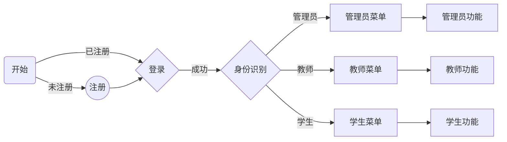
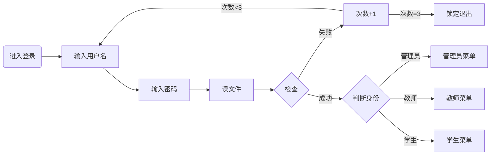

# 项目概述
1. 项目名称  
   校园信息管理系统（campus-information-management-system）。
2. 开发环境
 - 操作系统：WSL（Ubuntu）
 - 开发工具：VS Code
 - 语言版本：Python 3.13.12
 - 版本控制：Git

# v1.0版本设计
1. 核心目标：GUI版，实现基本的注册、登录和信息管理功能
2. 主要功能：
- [ ] 管理员账号生成
- [ ] 管理教职工/学生账号
- [ ] 用户登录（三次机会）
- [ ] 教师添加课程和录入成绩
- [ ] 学生成绩查看和排序
- [ ] 基本信息修改
3. 技术实现
 - 

# v2.0版本设计
1. 核心目标：Web版，实现多种角色功能
2. 主要功能：
- [ ] 管理员
- [ ] 教师
- [ ] 学生
- [ ] 行政管理
- [ ] 辅导员/班主任
- [ ] 后勤
3. 技术实现
 - 

# 业务流程图
## 主业务流程

## 登录流程

## 管理员功能
- 创建教师/学生账号
- 删除/修改教师/学生账号信息
- 查看所有账号
- 重置密码
## 教师功能
- 增加课程
- 录入成绩
- 修改密码
## 学生功能
- 查看成绩、排名、绩点
- 修改密码
## 内置功能
- 成绩排序
- 绩点计算
