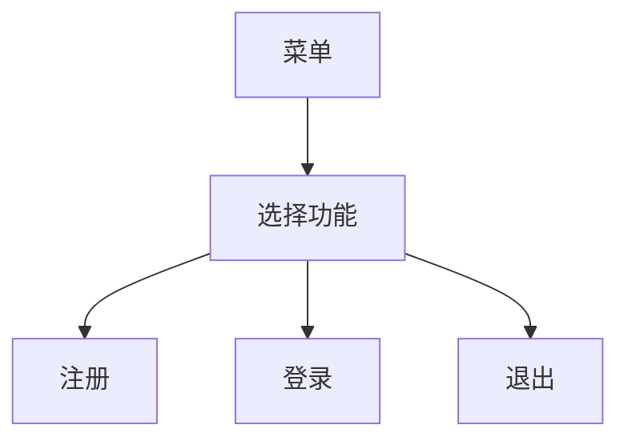

# 项目概述
1. 项目名称  
   校园信息管理系统（campus-information-management-system）。
2. 开发环境
 - 操作系统：WSL（Ubuntu）
 - 开发工具：VS Code
 - 语言版本：Python 3.13.12
 - 版本控制：Git

# v1.0版本设计
1. 核心目标：实现基本的注册、登录和信息管理功能
2. 主要功能：
- [√] 用户注册（用户名查重、密码长度检查）
- [√] 用户登录（三次机会）
- [ ] 学生管理（待开发）
- [ ] 课程管理（待开发）
- [ ] 成绩管理（待开发）
3. 技术实现
 - 文件存储、函数模块化

# 业务流程图
