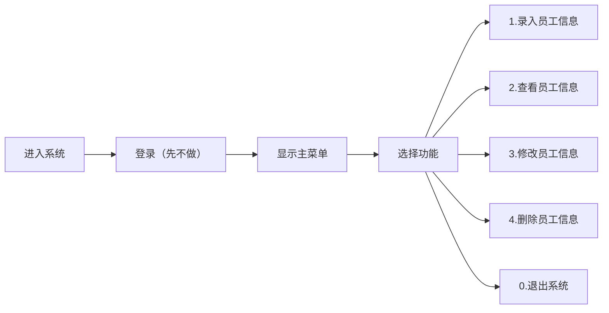

# 项目概述

1. 项目名称  
   员工管理系统（employee management system）。
2. 开发环境
 - 操作系统：WSL（Ubuntu）
 - 开发工具：VS Code
 - 语言版本：Python 3.13.11
 - 版本控制：Git
3. 项目定位  
   Python开发的企业员工管理系统，帮助企业进行员工信息管理。

# 需求分析

1. 核心问题  
   企业员工管理数据多、流程复杂
2. 用户是谁  
   企业行政管理人员：员工信息管理  
   企业员工：查看自己的信息  
3. 主业务流程

4. 功能清单
   - 核心功能  
     员工信息录入  
     员工信息修改  
     员工信息查看与显示  
     员工信息删除  
     信息保存到文件与从文件调取信息  
     按部门统计员工人数  
     按员工薪资、等级等进行排序
   - 可扩展功能（后期再考虑）
     登录与权限（后期再考虑）  
     部门间沟通，如考核、人员招聘等  
     上下级沟通，如发送通知、请假批示等

# 安装使用

# v1.0版本设计
1. 核心目标：
2. 主要功能：
 - 
3. 技术实现
 - 

# v2.0版本设计
1. 核心目标：
2. 主要功能：
 - 
3. 技术实现
 - 

# v3.0版本设计
1. 核心目标：
2. 主要功能：
 - 
3. 技术实现
 - 