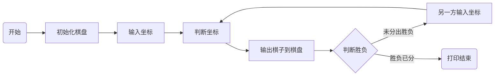

# 项目概述
1. 项目名称  
   简易五子棋（simple-five-in-a-row）  
   Python开发一个控制台版的简易五子棋游戏，熟悉五子棋游戏的实现原理，同时巩固Python基础知识的应用
2. 开发环境
 - 操作系统：WSL（Ubuntu）
 - 开发工具：VS Code
 - 语言版本：Python 3.13.12
 - 版本控制：Git

# v1.0版本
1. 核心目标：实现人人对战判断胜负
2. 主要功能：
- [√] 初始化棋盘
- [√] 打印棋盘
- [√] 记录棋子坐标
- [√] 判断棋子坐标
- [√] 判断指定坐标位置是否有棋子
- [√] 判断当前下棋者
- [√] 五子棋算法实现
- [√] 打印胜利棋盘及赢家
- [√] 界面美化
3. 技术实现
 - print()
 - 二维列表
 - 嵌套for循环
 - 多条件if判断
 - ★关键点：五子棋算法
 - ★为控制台设置不同的字体和背景色

# 流程图

