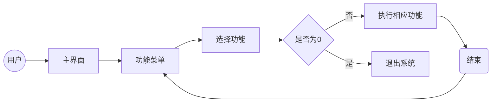

# 项目概述
1. 项目名称  
   学生信息管理系统（student-information-management-system）  
   使用Python语言中的文件读写、字典操作、字符串格式化、列表排序、lambda表达式等技术，开发的控制台程序，达到智能化管理学生信息的目的
2. 开发环境
 - 操作系统：WSL（Ubuntu）
 - 开发工具：VS Code
 - 语言版本：Python 3.13.12
 - 版本控制：Git

# v1.0版本
1. 核心目标：实现信息增删改查排序
2. 主要功能：
- [√] 录入学生信息
- [√] 删除学生信息
- [√] 修改学生信息
- [√] 按学生ID查询信息
- [√] 按学生姓名查询信息
- [√] 显示所有学生信息
- [√] 统计学生总人数
- [√] 排序
3. 技术实现
 - json文件读写
 - 字典操作
 - 字符串格式化
 - 列表排序
 - lambda

# 流程图
